# 👶 ChildSystem

A web-based **Child Management System** designed to manage children, caregivers, and related activities efficiently.
The system provides a centralized platform for tracking child information, managing users, and organizing interactions between parents, therapist, or administrators.

---

## 🚀 Features

* 👤 User Authentication (Login/Register)
* 🧒 Child Management (add, edit, view children)
* 🏫 Organization / Business Management
* 📅 Scheduling / Reservations
* 📝 Reviews or Feedback system
* 🔐 Role-based access (Admin / User / Therapist)
* 📊 Dashboard for managing data

---

## 🛠️ Tech Stack

### Backend

* Python (Django)
* JWT Authentication

### Frontend

* HTML / CSS / Bootstrap
* JavaScript

### Database

* SQLite

### Other

* Git & GitHub

---

## 📦 Installation

### 1. Clone the repository

```bash
git clone https://github.com/NaumVlavceski/ChildSystem.git
cd ChildSystem
```

### 2. Backend Setup

```bash
pip install -r requirements.txt
python manage.py migrate
python manage.py runserver
```

---

### 3. Database Configuration

Update your database settings:

* Django → `settings.py`


### 4. Run the Application

* Run application: [http://localhost:8000](http://localhost:8000)

### Made by
Naum Vlavcheski \
Damjan Serafimovski \
Daniel Pazarkoski 

### Photos

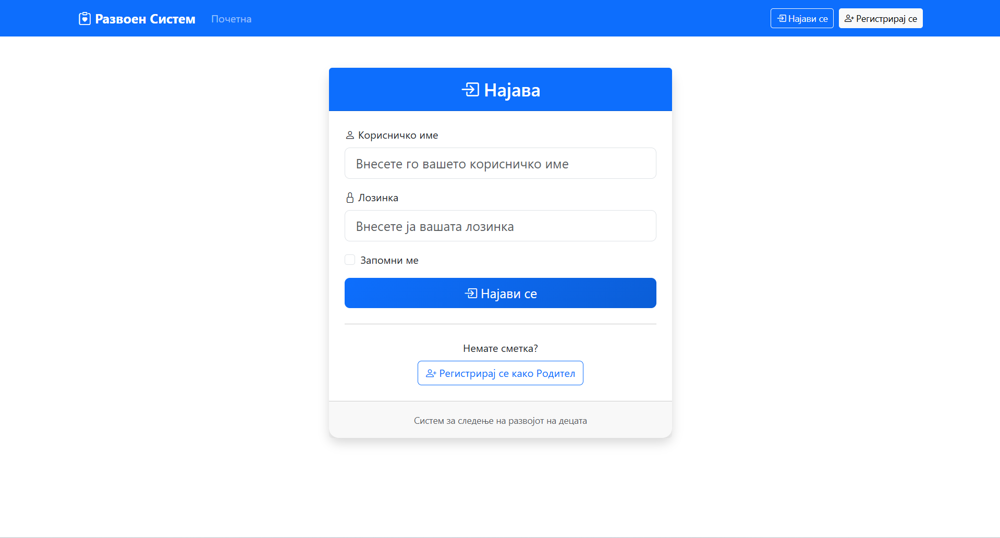
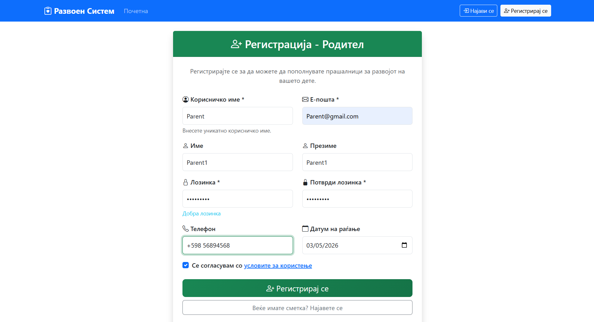
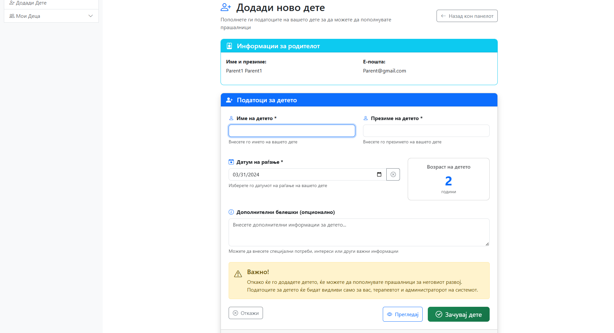
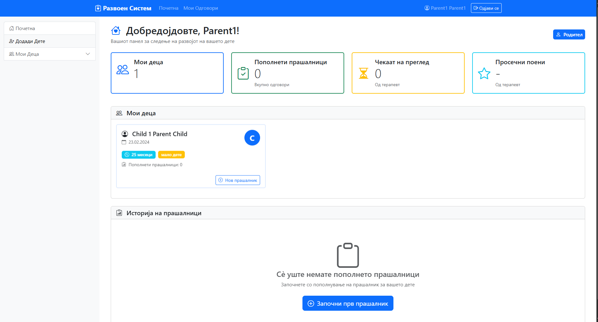
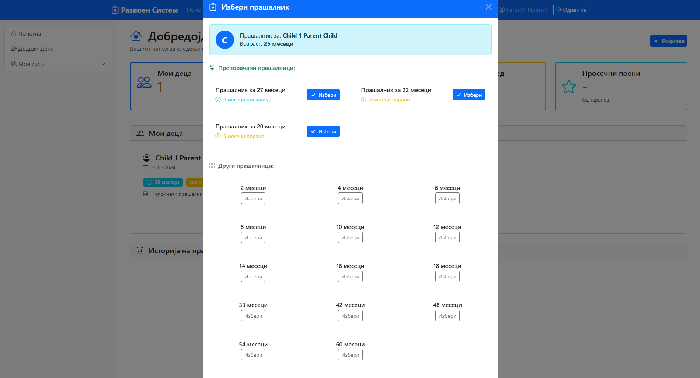
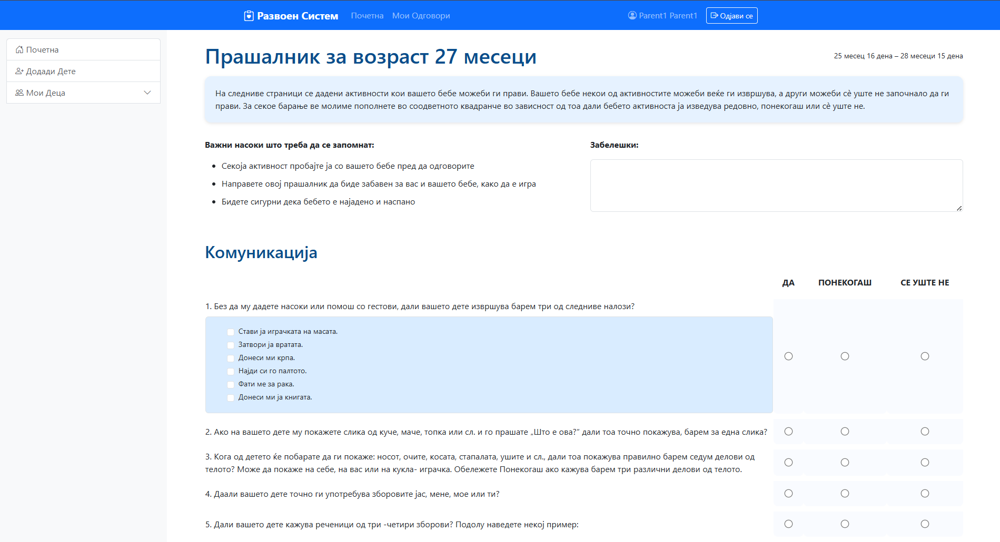
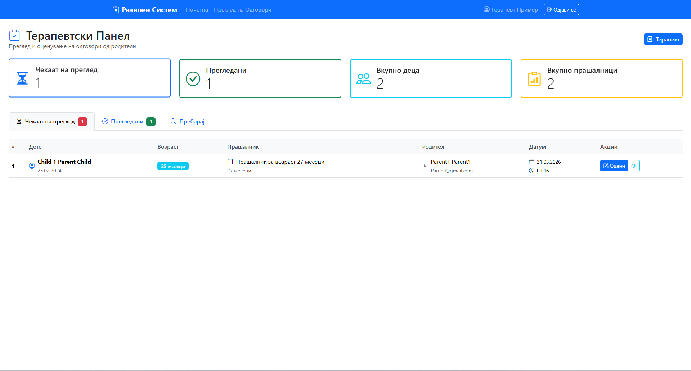
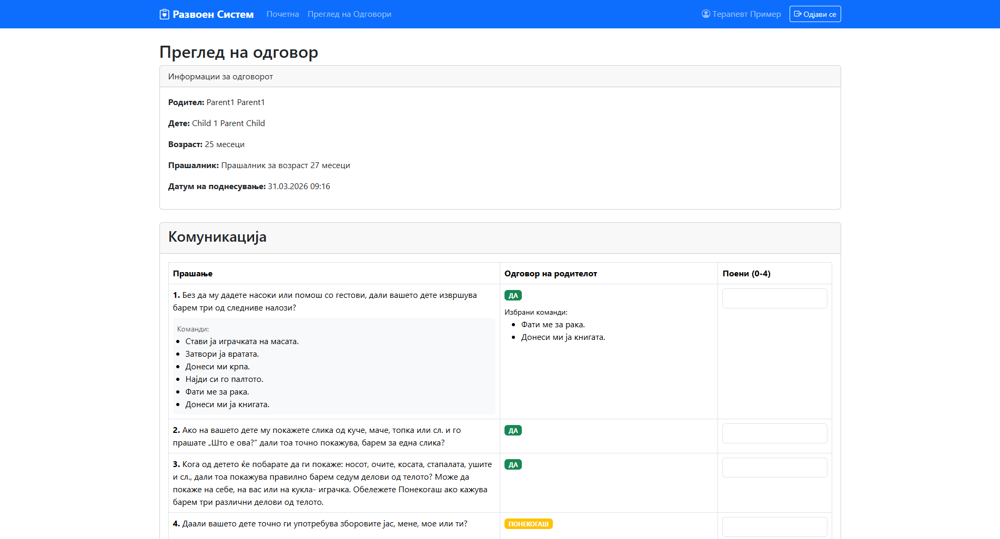
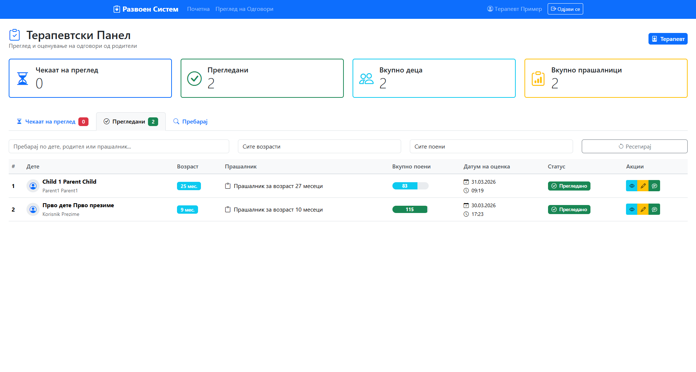
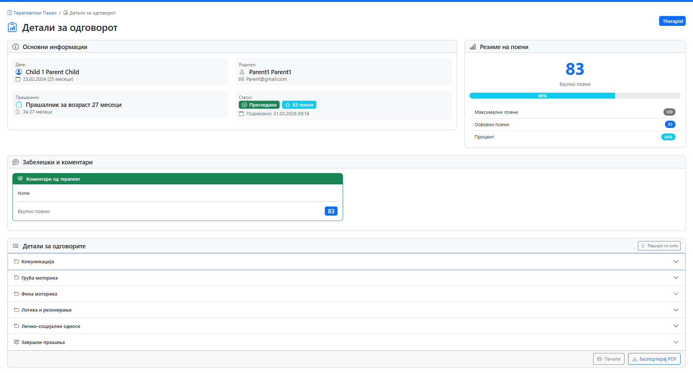
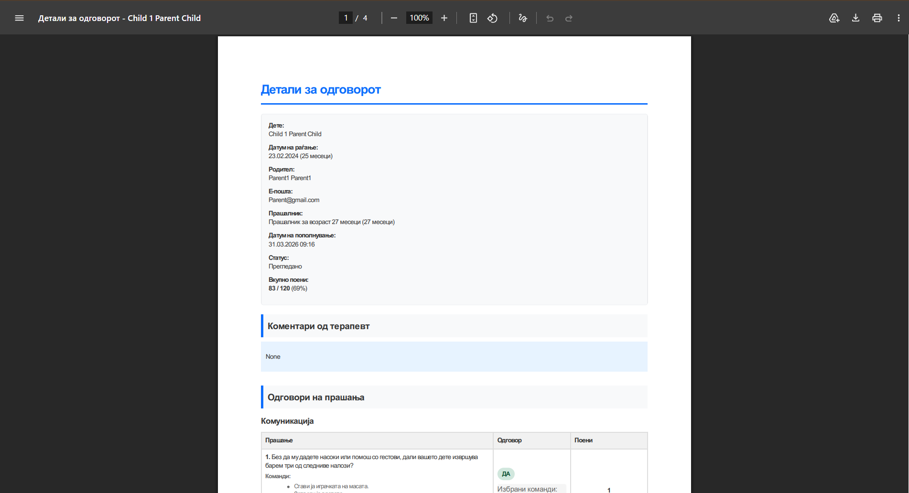
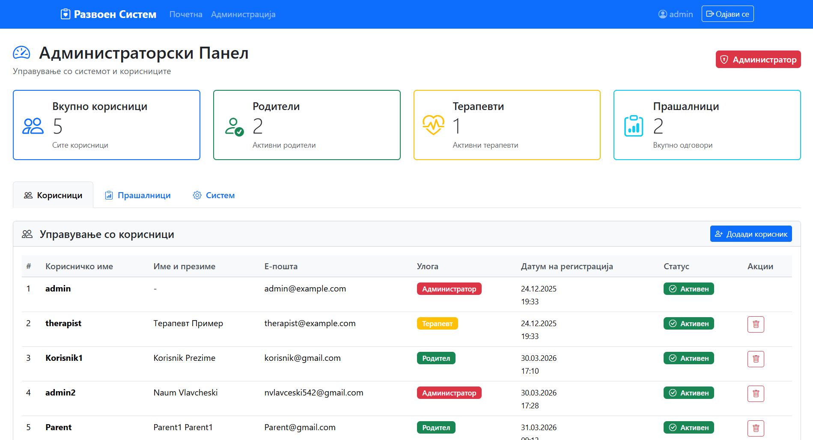
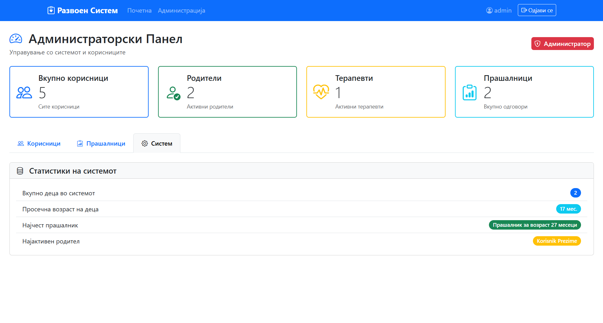